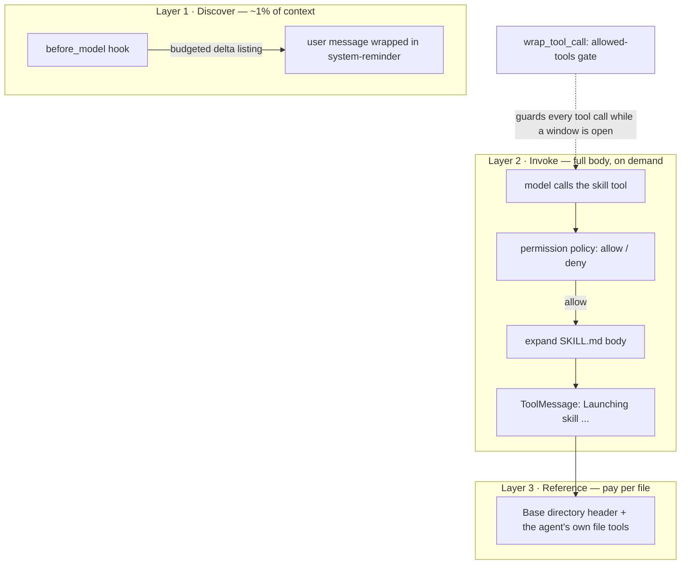

<div align="center">

# skillbay

**Pluggable skill middleware for LangChain agents — a skill system designed for business services.**

[English](./README.md) | [简体中文](./README.zh-CN.md)


</div>

## Why skillbay

Anthropic ships a quietly excellent skill system: a `SKILL.md` file turns a folder of
procedures, references and scripts into something the model can discover on demand, load
lazily, and follow precisely. It is one of the best answers so far to a recurring agent
problem — *how does one agent carry many specialties without blowing its context window?*

That mechanism is universal, but the original was purpose-built for one scenario: a
developer's coding and work session. skillbay carries the mechanism into a different
scenario — **business service agents**: the customer-service entry of a consumer app
(think of the support chat inside Meituan), an enterprise finance or HR assistant, an
ops copilot wired into company systems. The context-window problem is the same; the
ground rules are not:

| | Claude Code: coding & personal work | skillbay: business service agents |
|---|---|---|
| Who talks to the agent | A developer, able to judge "should this run?" | An end customer or an employee — nobody able to review a tool call, and no conversation that can hang on a confirmation prompt |
| What a skill is | A coding workflow, installed ad hoc by its user | A business capability — refund handling, reimbursement policy, leave inquiry — owned by the company and governed like any business code |
| Whose authority the agent acts with | The developer's own account | The company's — customers never opted into the agent's internals, so blast radius must be bounded by design |
| Session shape | One developer, one terminal session | Thousands of concurrent conversations, checkpointed and resumable |

**skillbay** therefore ports the skill system 1:1 in semantics onto LangChain's middleware
API, then deliberately diverges wherever the scenario — not the mechanics — demands it.
The divergences are the interesting part — the rest of this document explains them.

## Core design: three-layer progressive disclosure

The context-window economy is the central constraint. skillbay spends it in three layers,
each paying only for what the task actually needs:



1. **Discover.** Before every model call, a budgeted menu of available skills is injected
   as a `<system-reminder>` user message — names and one-line descriptions only, hard-capped
   at 1% of the context window. The listing announces *deltas only*: with accounting kept in
   agent state, each skill is announced exactly once per thread, no matter how many turns
   follow.
2. **Invoke.** When the model decides a skill matches the task, it calls the `skill` tool.
   Only then is the full SKILL.md body expanded (arguments substituted, directories resolved)
   and returned as a ToolMessage.
3. **Reference.** The expanded body opens with a `Base directory` header. Any sidecar files
   the skill ships (templates, references, scripts) are read by the agent's *own* file tools,
   on demand. The middleware ships no file tools — it only provides the path anchor.

The result: a deployment carrying dozens of skills pays a menu-sized cost per turn, and a
body-sized cost only for the skill actually in use.

## Business transformation: five deliberate divergences

### 1. No human approval — the contract is allow/deny

The reference implementation inherits Claude Code's three-state permission model
(`allow` / `ask` / `deny`). In a service scenario the person on the other end is a
customer or an employee — not someone who can judge whether a tool call is safe, and a
live conversation cannot hang on a confirmation dialog. The decision belongs to the
platform, and it is made at deploy time. skillbay therefore makes the contract
**two-valued**: the `permission_policy` seam returns `allow` or `deny` — nothing else.
Any non-`allow` return value is denied.

> Fail closed. That is the whole approval design.

### 2. Skills are deploy artifacts, not runtime discoveries

In Claude Code, the person who installs a skill is the person it affects — runtime
discovery and marketplaces are reasonable self-service. A business service breaks that
symmetry: the company operates the agent while customers and employees bear the
consequences. And the skills differ in kind — refund rules, reimbursement workflows and
HR policies are business capabilities, not developer conveniences. A skill "appearing"
in a mounted directory would put unreviewed behavior in front of customers, with no
review, no version, no rollback.

skillbay therefore loads the skill set **once, at construction, and freezes it**:

- Skills live in git, go through code review, and ship with the release.
- Runtime file changes have no effect until the process restarts.
- Skill identity is the directory name; frontmatter `name` is display-only, so renames on
  disk can't silently re-route behavior.

### 3. The allowed-tools gate: blast radius as a first-class constraint

A service agent acts with the company's authority: a customer-service skill must never
reach beyond its charter. A skill's frontmatter can declare `allowed-tools`; while that
skill is active, the middleware's `wrap_tool_call` hook **enforces** the whitelist on
every single tool call — the model is not trusted to comply, it is prevented.

The enforcement window is derived purely from the message history (no extra state to
corrupt):

- **Opens** when a skill call succeeds — its ToolMessage starts with `Launching skill:`.
- **Closes** at the next real user message; `<system-reminder>` injections don't close it,
  because they are part of the same task.
- **Unions** when several skills are active, and **only tightens**: a skill without
  `allowed-tools` can never widen an existing restriction.
- **The `skill` tool itself is blocked inside the window**, closing the escalation path of
  chaining into an unrestricted skill mid-turn.

### 4. Denial is never a privilege-escalation path

Every activation path re-checks the policy:

- A denied skill call produces no `Launching skill:` marker, so the allowed-tools gate
  never treats a rejected skill as active.
- When a skill's body is re-injected after summarization, the policy is consulted again —
  re-injection cannot become a bypass channel.

### 5. Accounting lives in agent state, not process globals

The reference implementation tracks announced/invoked skills in module-level dicts — fine
when one developer owns one process, wrong for a service answering thousands of
concurrent, checkpointed, resumable conversations. skillbay puts both
ledgers in `SkillState` (an `AgentState` extension), which buys:

- **Persistence** — accounting survives checkpoint/resume; no duplicate announcements after
  a restart.
- **Isolation** — per-thread state, no cross-talk between concurrent conversations.
- **Summarization survival** — when a `SummarizationMiddleware` compresses away the turn
  that invoked a skill, the invocation record survives in state. `before_model` notices the
  missing `tool_call_id`, re-expands the body, and re-injects it as a system-reminder. The
  skill's guidelines survive the compaction that killed the transcript.

## Resilience and security defaults

- **One broken skill never breaks startup.** Frontmatter parsing never throws: it retries
  with auto-quoting (the classic `paths: **/*.{ts,tsx}` hand-slap) and degrades to an empty
  header. A skill missing its `description` is skipped with a warning, not fatal.
- **Shell blocks are off by default.** SKILL.md can carry inline `` !`command` `` blocks whose
  output replaces the block. That is arbitrary code execution by design, so it requires an
  explicit `enable_shell_blocks=True` — a safety switch, not a preference.
- **Auditability built in.** Five audit events (`skill_invoked`, `skill_denied`,
  `skill_reinjected`, `skills_announced`, `tool_call_blocked`) flow through one
  callback seam; wire it to your logging/metrics stack. Audit failures never take
  down the agent.
- **Context budget with graceful degradation.** If the skill listing exceeds its 1% budget,
  descriptions are truncated to an equal share; in extremis only names are announced. The
  discovery layer never crowds out the task itself.

## Concept mapping

| Claude Code original | skillbay implementation |
|---|---|
| `skill_listing` attachment (incremental) | `before_model` hook: budgeted delta listing in a `<system-reminder>` user message |
| `SkillTool.call` → newMessages | `@tool skill(skill, args)`: body expanded, returned as a ToolMessage |
| `invoked_skills` (compaction survival) | `SkillState.skill_invocations` ledger + `before_model` re-injection |
| `checkPermissions` (allow/ask/deny) | Two-valued `permission_policy` seam; non-`allow` is denied |
| `allowed-tools` (advisory, client-enforced) | `wrap_tool_call` hard gate, window derived from message history |
| Process-level skill ledgers | `announced_skills` / `skill_invocations` in `AgentState` |

## Project layout

```
skillbay/
├── src/skillbay/
│   ├── middleware.py    # SkillMiddleware: skill tool, allowed-tools gate, before_model
│   ├── core.py          # Skill model, directory loading, 1%-budget listing formatter
│   ├── expansion.py     # SKILL.md expansion pipeline (fixed 5-step order)
│   ├── frontmatter.py   # YAML header parsing with repair-and-retry
│   └── __init__.py      # public API surface
├── tests/               # pytest suite (pure functions + middleware integration)
├── pyproject.toml       # uv-managed, Python >= 3.12, hatchling build
├── README.md            # this file
└── README.zh-CN.md      # Chinese version
```

## Quick start

```bash
uv add skillbay            # or: pip install skillbay
uv add pyyaml              # optional: enables full YAML frontmatter parsing
```

A skill is just a directory with a `SKILL.md` — here, a customer-service skill:

```
skills/
└── refund-policy/
    └── SKILL.md
```

```markdown
---
description: Handle a refund request according to current company policy.
allowed-tools: OrderQuery, RefundSubmit
argument-hint: order ID
arguments: order
---
Handle the refund request for order $order. The policy checklist lives in ${SKILL_DIR}/policy.md.
```

Wire it into any LangChain `create_agent` agent:

```python
from skillbay import SkillMiddleware

mw = SkillMiddleware(
    skills_dirs=["skills"],
    # Deploy-time whitelist: only chartered skills run, everything else is denied.
    permission_policy=lambda skill, args: "allow" if skill.name in {"refund-policy", "faq"} else "deny",
    audit=lambda event: print(event),  # route to your observability stack
)
agent = create_agent(model, tools=[...], middleware=[mw])
```

### Frontmatter reference

| Field | Required | Effect |
|---|---|---|
| `description` | yes | Listing text; drives model selection. Missing → skill skipped. |
| `allowed-tools` | no | Whitelist enforced while the skill's window is open. |
| `arguments` | no | Declares named arguments (`$foo`), mapped positionally. |
| `argument-hint` | no | Human-facing hint for the argument string. |
| `when_to_use` | no | Extra trigger guidance, appended to the listing description. |
| `disable-model-invocation` | no | Hidden from the listing; user-triggered only. |
| `shell` | no | Interpreter for `` !`...` `` blocks (feature is off by default). |
| `model`, `paths`, `version` | no | Parsed and carried; enforcement is on the roadmap. |

## Roadmap

- **Per-skill model override** — the `model` field is already parsed; switching execution
  models per skill is the next growth point.
- **Conditional activation** — the `paths` field is parsed; gating skill availability on
  the working set is next.
- **Listing localization** — the discovery layer currently speaks English only.

## Contributing

Code comments and docstrings are English and kept short; design rationale belongs in this
README, not in file headers. Run `uv run pytest` and `uv run ruff check .` before submitting.
