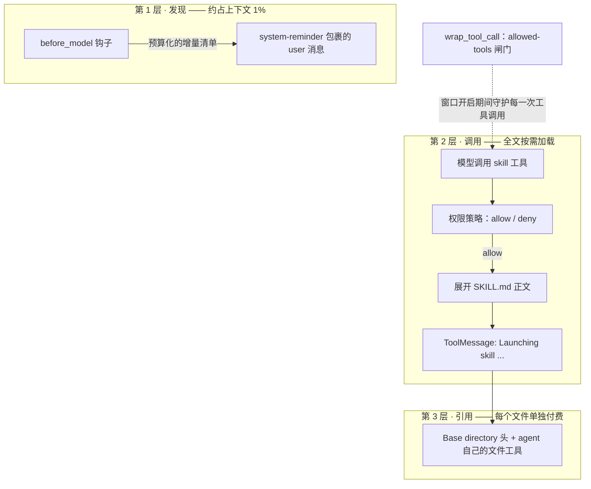

<div align="center">

# skillbay

**适用于 LangChain 的可插拔技能中间件 —— 为业务服务设计的Skill系统**

[English](./README.md) | [简体中文](./README.zh-CN.md)


</div>

## 为什么要有 skillbay

Anthropic 提出了一套相当出色的 Skill 系统：一个 `SKILL.md` 文件就能把一个目录里的
流程、参考资料和脚本，变成模型可以按需发现、延迟加载、精确执行的能力。这是目前为止
对 agent 领域一个经典问题最好的回答之一——*一个 agent 如何同时携带多种专业能力，又不
撑爆上下文窗口？*

这套机制本身是通用的，但原系统是为一个特定场景打造的：开发者的编码与工作台。
skillbay 要把它搬进另一个场景——**业务服务**：消费级 App 的客服入口（比如美团 App
里的客服会话）、公司的智能财务 / 人事助手、接入内部系统的运营 copilot。要解的上下文
窗口难题相同，但运行的地基规则完全不同：

| | Claude Code：编码 / 工作场景 | skillbay：业务服务场景 |
|---|---|---|
| 和 agent 对话的人 | 开发者，能自己判断「这条命令该不该跑」 | 终端顾客或普通员工——没人能评审一次工具调用，会话也不可能挂起等一个确认框 |
| 技能是什么 | 编码工作流，用户随手安装 | 企业的业务能力——退款处理、报销政策、假期查询——由公司拥有，像业务代码一样被治理 |
| agent 以谁的身份行事 | 开发者本人的账号 | 公司的身份，而顾客从没同意过 agent 内部的任何细节——爆炸半径必须由设计兜底 |
| 会话形态 | 一个开发者、一个终端会话 | 成千上万路并发会话，带 checkpoint、可恢复 |

**skillbay** 因此把这套 Skill 系统在语义上 1:1 移植到 LangChain 的 middleware API
上，然后在所有「场景使然」（而非机制使然）的地方做了刻意的偏离。这些偏离才是
本项目真正的内容——本文档余下部分逐一解释。

## 核心设计：三层渐进式披露

上下文窗口的开销是中心约束。skillbay 把它拆成三层，每层只为任务真正需要的部分付费：



1. **发现。** 每次调模型前，把可用技能的「菜单」注入为一条 `<system-reminder>` 的
   user 消息——只有名字和一行描述，硬性预算为上下文窗口的 1%。清单只播报**增量**：
   记账放在 agent state 里，每个技能在一个 thread 里只播报一次，后续多少轮都不重复。
2. **调用。** 模型判定某个技能匹配任务时，调用 `skill` 工具。此时才展开 SKILL.md
   全文（替换参数、解析目录），作为 ToolMessage 返回。
3. **引用。** 展开后的正文以 `Base directory` 头开头。技能附带的旁路文件（模板、
   参考资料、脚本）由 agent **自己的**文件工具按需读取。中间件不提供文件工具——它只
   提供路径锚点。

结果是：携带几十个技能的部署，每轮只付一份「菜单」的成本，只有真正用到的技能才付
「全文」的成本。

## 业务改造：五处刻意的偏离

### 1. 没有人工审批——契约只有 allow/deny

参考实现继承了 Claude Code 的三态权限模型（`allow` / `ask` / `deny`）。但在业务服务
场景里，和 agent 对话的是顾客与员工——他们既没有能力判断一次工具调用是否安全，进行
中的会话也不可能为了一个确认框挂起。这个决策属于平台，且必须在部署时做出。skillbay
因此把契约**收敛为两值**：`permission_policy` 缝只返回 `allow` 或 `deny`。任何非
`allow` 的返回值一律拒绝。

> Fail closed。这就是审批设计的全部。

### 2. 技能是部署产物，不是运行时发现

在 Claude Code 里，安装技能的人就是被技能影响的人——运行时发现和技能市场是合理的
自助。业务服务打破了这个对称：公司运营 agent，承担后果的却是顾客和员工。技能的性质
也不同——退款规则、报销流程、人事政策是业务能力，不是开发者的便利工具。让一个技能
在挂载目录里「冒出来」，等于把未经评审的行为直接推到顾客面前：没有 review、没有版本、
没有回滚。

因此 skillbay 在**构造时一次性加载技能集合并锁定**：

- 技能进 git、走 code review、随版本发布。
- 运行期的文件变更在进程重启前不生效。
- 技能身份以目录名为准；frontmatter 的 `name` 只是显示名——磁盘上的改名不会悄悄
  改变路由行为。

### 3. allowed-tools 工具闸：爆炸半径是一等公民约束

业务服务里的 agent 以公司的身份行事——客服技能绝不能触及自身职权之外的工具。技能的
frontmatter 可以声明 `allowed-tools`；该技能生效期间，中间件的 `wrap_tool_call` 钩子
会对**每一次工具调用**强制执行白名单——不是「相信模型会遵守」，而是让它根本执行不了。

生效窗口完全从消息历史推导（没有可被污染的额外状态）：

- **开启**：某技能调用成功——其 ToolMessage 以 `Launching skill:` 开头。
- **关闭**：下一条真实 user 消息；`<system-reminder>` 注入不算新任务，不关窗口。
- **并集**：多个技能同时生效时白名单取并集，且**只紧不松**——没声明
  `allowed-tools` 的技能永远不能放宽已生效的限制。
- **窗口内连 `skill` 工具本身也拦**：封死「先调受限技能、再链一个不带限制的技能」
  的提权路径。

### 4. 被拒的技能永远不是提权通道

每条激活路径都会重新过策略：

- 被拒绝的技能调用不产生 `Launching skill:` 标记，allowed-tools 闸门因此不会把一个
  被拒技能当作已激活。
- 技能正文因摘要压缩而重注入时，会再次征求策略意见——重注入不能成为绕过审批的
  旁路。

### 5. 记账放在 agent state，而不是进程全局字典

参考实现把已播报/已调用的技能记在模块级 dict 里——一个开发者的单会话进程无所谓；
客服系统要同时服务成千上万路可恢复、带 checkpoint 的会话，这么做就是错的。skillbay
把两本账都放进 `SkillState`（`AgentState` 扩展），换来三件事：

- **持久化**——记账随 checkpoint 存活；进程恢复后不会重复播报。
- **隔离**——按 thread 隔离，并发会话互不串扰。
- **压缩存活**——当 `SummarizationMiddleware` 把调用技能的那一轮对话压缩掉时，调用
  记录仍在 state 里。`before_model` 发现 `tool_call_id` 从消息列表里消失，就重新展开
  正文并以 system-reminder 注入。技能的指引活过了杀死它的转写记录的那次压缩。

## 韧性与安全默认值

- **一个技能写坏，拖不垮启动。** frontmatter 解析永不抛异常：先试原文，失败后自动
  补引号重试（防住 `paths: **/*.{ts,tsx}` 这类经典手误），再失败降级为空头。缺
  `description` 的技能跳过并告警，而不是致命错误。
- **Shell 块默认关闭。** SKILL.md 可以携带内联 `` !`命令` `` 块，其输出会替换块本身。
  这是设计上的任意代码执行，因此必须显式传 `enable_shell_blocks=True`——这是安全
  开关，不是偏好设置。
- **审计内建。** 五类审计事件（`skill_invoked`、`skill_denied`、`skill_reinjected`、
  `skills_announced`、`tool_call_blocked`）经由同一个回调缝发出，接到你的日志/指标栈
  即可。审计自身的故障不会拖垮 agent。
- **上下文预算与优雅降级。** 清单超出 1% 预算时，各条描述均分剩余额度截断；极端
  情况只播报名字。发现层永远不去挤占任务本身的上下文。

## 概念映射

| Claude Code 原版 | skillbay 实现 |
|---|---|
| `skill_listing` 附件（增量播报） | `before_model` 钩子：预算化增量清单包进 `<system-reminder>` 的 user 消息 |
| `SkillTool.call` → newMessages | `@tool skill(skill, args)`：正文展开后作为 ToolMessage 返回 |
| `invoked_skills`（压缩存活） | `SkillState.skill_invocations` 账本 + `before_model` 重注入 |
| `checkPermissions`（allow/ask/deny） | 两值 `permission_policy` 缝；非 `allow` 一律拒绝 |
| `allowed-tools`（建议性，客户端自觉） | `wrap_tool_call` 硬闸门，窗口从消息历史推导 |
| 进程级技能账本 | `announced_skills` / `skill_invocations` 放进 `AgentState` |

## 项目结构

```
skillbay/
├── src/skillbay/
│   ├── middleware.py    # SkillMiddleware：skill 工具、allowed-tools 闸门、before_model
│   ├── core.py          # Skill 模型、目录加载、1% 预算清单格式化
│   ├── expansion.py     # SKILL.md 展开管线（五步顺序固定）
│   ├── frontmatter.py   # YAML 头解析，带修复重试
│   └── __init__.py      # 公共 API 面
├── tests/               # pytest 测试（纯函数 + 中间件集成）
├── pyproject.toml       # uv 管理，Python >= 3.12，hatchling 构建
├── README.md            # 英文版（即本文件的对照版）
└── README.zh-CN.md      # 中文版
```

## 快速开始

```bash
uv add skillbay            # 或 pip install skillbay
uv add pyyaml              # 可选：启用完整 YAML frontmatter 解析
```

技能就是一个放了 `SKILL.md` 的目录——比如一个客服技能：

```
skills/
└── refund-policy/
    └── SKILL.md
```

```markdown
---
description: Handle a refund request according to current company policy.
allowed-tools: OrderQuery, RefundSubmit
argument-hint: order ID
arguments: order
---
Handle the refund request for order $order. The policy checklist lives in ${SKILL_DIR}/policy.md.
```

接入任意 LangChain `create_agent` agent：

```python
from skillbay import SkillMiddleware

mw = SkillMiddleware(
    skills_dirs=["skills"],
    # 部署时定死白名单：只有纳入职权的技能能跑，其余一律拒绝。
    permission_policy=lambda skill, args: "allow" if skill.name in {"refund-policy", "faq"} else "deny",
    audit=lambda event: print(event),  # 接到你的可观测性栈
)
agent = create_agent(model, tools=[...], middleware=[mw])
```

### Frontmatter 字段参考

| 字段 | 必填 | 作用 |
|---|---|---|
| `description` | 是 | 清单文案，驱动模型选择；缺失则技能被跳过。 |
| `allowed-tools` | 否 | 生效窗口内强制执行的工具白名单。 |
| `arguments` | 否 | 声明命名参数（`$foo`），按位置对应。 |
| `argument-hint` | 否 | 给人看的参数提示。 |
| `when_to_use` | 否 | 补充触发指引，追加到清单描述后。 |
| `disable-model-invocation` | 否 | 不进清单，仅允许用户手动触发。 |
| `shell` | 否 | `` !`...` `` 块的解释器（功能默认关闭）。 |
| `model` / `paths` / `version` | 否 | 已解析并携带；执行逻辑在路线图上。 |

## 路线图

- **按技能切换模型**——`model` 字段已解析，按技能切换执行模型是下一个成长点。
- **条件激活**——`paths` 字段已解析，按工作集门控技能可用性紧随其后。
- **清单本地化**——发现层目前只有英文文案。

## 参与贡献

代码注释与 docstring 用英文、保持简短；设计思路写进本 README，不堆在文件头。提交前
请跑 `uv run pytest` 与 `uv run ruff check .`。
